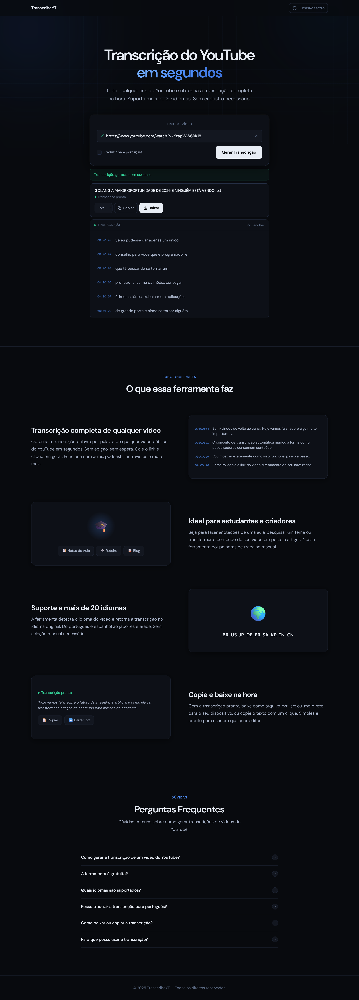

# transcribe-video

Ferramenta para transcrever vídeos do YouTube, disponível como **CLI** e **interface web**. Busca legendas diretamente do YouTube sem necessidade de API key e suporta tradução automática para português via Google Tradutor (gratuito).



## Requisitos

- Python 3.10+

## Instalação

```bash
pip install -e .
```

Para desenvolvimento:

```bash
pip install -e ".[dev]"
```

## Uso

```bash
transcribe-video-web
```

Sobe um servidor Flask em `http://localhost:5000`.

**Funcionalidades da interface:**

- Cole a URL do vídeo e clique em **Gerar Transcrição**
- Marque **"Traduzir para português"** para traduzir qualquer idioma automaticamente
- Preview da transcrição com timestamps na própria página
- Se traduzido, alterne entre o idioma original e o português no preview
- Escolha o formato de download: `.txt`, `.srt` ou `.md`
- Botão **Copiar** para copiar direto para a área de transferência
- Botão **Baixar** para salvar o arquivo com o título do vídeo como nome

## Formatos de saída

| Formato | Descrição |
|---------|-----------|
| `.txt` | Texto com timestamps (`HH:MM:SS\ntexto`) |
| `.srt` | Formato padrão de legenda (SubRip) |
| `.md` | Markdown com timestamps em negrito |

## Tradução

A tradução usa a biblioteca `deep-translator` com o Google Tradutor, sem necessidade de API key. Os timestamps são preservados — apenas as linhas de texto são traduzidas e reconstruídas no mesmo formato.

## Desenvolvimento

```bash
# Rodar testes
pytest
```
